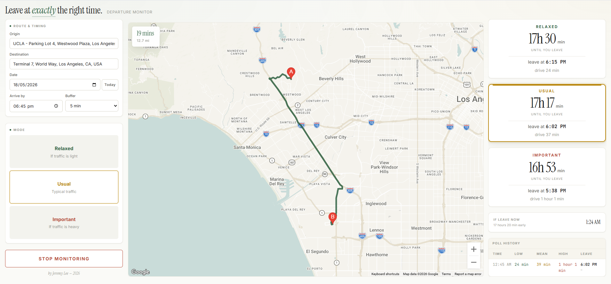

*[HERO IMAGE: LA freeway traffic — see "Image credits" at the end for free-licensed sources]*

## The problem with leaving on time in LA

If you've lived in Los Angeles, you know this dance.

You have somewhere to be. Maybe it's a 4:30 PM flight out of LAX, a 7 PM dinner downtown, or your cousin's wedding in San Gabriel at 2. The drive itself isn't long — Google Maps says 28 minutes — but you've been burned enough times to know that 28 minutes can become 65 minutes with no warning, and the difference between leaving at 1:15 versus 1:25 can decide whether you walk in calm or sweating through your shirt.

So you do what every Angeleno does: you sit at home, refreshing Google Maps every few minutes, doing mental subtraction.

> *"It's 28 minutes now. If I add a 15-minute buffer... and traffic usually gets worse around 1:30... should I leave in 5 minutes? 12? Do I have time to put on real shoes?"*

The information is all there in Google Maps. It even gives you that helpful little range — *"typically 22–50 min"* — that captures exactly how unpredictable your route is. But it's static. It doesn't tell you *when* to leave. It tells you what driving conditions look like right now, and leaves the optimization problem to you.

I wanted to leave **as late as possible** without being late. That's two competing goals: don't waste time pacing around the kitchen, and don't get stuck on the 10 with no margin. The optimization is mostly mental math, repeated every few minutes, until you finally commit and walk out the door.

So I built a small thing to do that math for me.

## What it does

It's a single-page web app you open in a browser tab while you're getting ready. You tell it three things:

- Where you're starting from
- Where you're going
- When you need to be there

It then picks the **latest possible departure time** that still gets you there on time, displays a countdown, and quietly polls Google's Routes API in the background to update the recommendation as traffic shifts. When the moment to actually leave arrives, it fires a browser notification and an on-screen alert.

The countdown comes in three flavors, side by side, so you can pick your risk tolerance for any given trip:

- **Relaxed** — assumes traffic stays light. Latest leave-by time.
- **Usual** — typical traffic for this route at this time. Middle ground.
- **Important** — assumes traffic gets bad. Earliest leave-by time, with margin built in.

For a Tuesday lunch with a friend who's chronically late anyway, I pick Relaxed and squeeze every extra minute at home. For a flight or a job interview, I pick Important and accept that I might arrive twenty minutes early.


*The dashboard mid-monitoring: a 6:45 PM arrival at LAX Terminal 7 from UCLA. Look at the spread — Relaxed says 24 minutes of driving, Important says 61. Same route, same destination, same arrival target. The mode you pick decides whether you leave at 6:15 PM or 5:38 PM.*

That screenshot is the whole pitch of the tool in one image. Twenty-four minutes versus sixty-one minutes is not a small difference — it's the difference between *one more episode* and *go now*. And it's not the tool guessing. It's Google Maps' own range, made into a decision you can act on.

## How it works — the three traffic models

The clever bit (and honestly the only bit I'm proud of) is that those three risk profiles aren't something I invented. They come straight out of Google's Routes API.

When you query Google for a route, you can specify a `trafficModel` parameter. There are three options:

- `OPTIMISTIC` — assumes traffic conditions are better than typical
- `BEST_GUESS` — Google's realistic point estimate using live and historical data
- `PESSIMISTIC` — assumes worse-than-typical conditions

Fire the same route query three times with those three values and you get three different durations. That spread is exactly the "typically 22–50 min" range Google Maps shows in its UI. **They're using the same three values.** It's just that the consumer Maps app shows you the range and lets you eyeball it, while the developer API hands you each estimate as a number you can compute with.

So `Relaxed = OPTIMISTIC`, `Usual = BEST_GUESS`, `Important = PESSIMISTIC`. The tool isn't predicting traffic better than Google. It's just packaging Google's own prediction range into a decision.

*[DIAGRAM 1: the three_traffic_models_range diagram I generated for you — capture the rendered diagram and save as `./images/diagram-traffic-models.png`]*

There's one small gotcha I spent an embarrassing amount of time on: `trafficModel` only takes effect when `routingPreference` is set to `TRAFFIC_AWARE_OPTIMAL`. The other routing preferences silently ignore the parameter and return the same number every time. The API doesn't error or warn — it just gives you what looks like real data, except it's identical regardless of which model you asked for. If you're building anything similar: check that setting first.

## The sampling problem

Here's where the design gets a little more interesting.

Naive version: every few minutes, ask Google "how long is the drive right now?" and update the countdown. This works, sort of, but it has a subtle flaw. If I'm planning to leave at 6:00 PM and it's currently 5:00 PM, "the drive right now" tells me what traffic looks like at 5:00 PM — not at 6:00 PM. And in LA, those two numbers can be very different. The 405 at 5:00 PM and the 405 at 6:00 PM are almost different freeways.

What I actually want to know is: **how long will the drive take if I leave during my likely departure window?**

So instead of polling current conditions over and over, the tool samples the *future*. On startup, it fires one "anchor" probe asking Google for the drive time if I left 20 minutes before my target. That gives a baseline duration. From the baseline, it computes a "realistic departure window" — roughly the range of times I'd plausibly leave to arrive on schedule.

Then every poll cycle, it picks two sample times *inside that window*, plus one "now" sample for live conditions. Each sample fires the three traffic-model queries in parallel. So a single poll cycle = 3 samples × 3 traffic models = 9 Routes API calls.

*[DIAGRAM 2: the anchor_and_fan_out_sampling diagram I generated for you — capture the rendered diagram and save as `./images/diagram-sampling.png`]*

Polling cadence adapts based on how close I am to leaving:

- More than 60 minutes out → poll every 15 minutes
- 30 to 60 minutes out → every 8 minutes
- Less than 30 minutes out → every 3 minutes

The further from departure, the less anything has changed; the closer I get, the more it matters that the numbers are fresh.

## How to set it up

The whole thing is one HTML file. No build step, no install, no server. Open it in a browser. The only external dependency is Google Maps Platform.

Setup takes about five minutes:

**1. Get a Google Maps API key.**

Go to the [Google Cloud Console](https://console.cloud.google.com/), create a project (or use an existing one), then `APIs & Services → Credentials → Create Credentials → API key`. Copy the key — it'll look like `AIzaSy...`.

**2. Enable four APIs.**

Under `APIs & Services → Library`, search for and enable each of these:

- **Routes API** — the traffic-aware forecasts (this is the main one)
- **Maps JavaScript API** — renders the map preview
- **Places API** — address autocomplete on the input fields *(use the classic Places API, not "Places API (New)" — the autocomplete widget hasn't been updated for the new version yet)*
- **Directions API** — draws the route polyline on the map

[SCREENSHOT: Google Cloud Console with the four enabled APIs highlighted. Save as `./images/screenshot-cloud-console.png` — caption: "The four APIs you need enabled."]

**3. (Recommended) Restrict the key.**

While you're in Credentials, click your key and under `API restrictions`, check only those four APIs. This means if the key leaks, nobody can use it for anything else on your bill.

**4. Paste the key into the HTML.**

Open the HTML file in a text editor. At the very top, there's a line that reads:

```js
const API_KEY = 'fill in your Google API here';
```

Replace the placeholder with your actual key, save, and open the file in a browser.

**5. Use it.**

Type your origin, destination, and target arrival time. Click "Start Monitoring." The countdown begins, the map draws your route, and the tool polls Google in the background. When it's time to leave, you'll get a browser notification (if you've granted permission) and an on-screen alert.

A poll cycle costs roughly $0.05 in Routes API usage at the time of writing, and a typical monitoring session uses 5–15 cycles. So a single trip from my couch to LAX costs me somewhere between fifty cents and a dollar to plan. Cheaper than the parking ticket I'd get for arriving late.

## Why I made the UI like that

A few of the design decisions are worth talking about briefly, because they affect how the tool actually feels to use.

**Three countdowns at once, side by side.** I considered making the risk profile a dropdown — pick Usual, see one countdown. But in practice, the *spread* between the three is the information I actually want. Go back to the UCLA-to-LAX screenshot above: the spread between Relaxed and Important is 37 minutes, which is huge. That gap tells me the route is wildly variable and I should pick Important for anything I care about. On a calmer route, the three modes might cluster within five minutes of each other, and Relaxed becomes safe. **The gap is the signal.** Hiding two of the three would hide that signal.

**The poll history table.** Every poll appears as a row at the bottom-right of the dashboard, with the leave-by time and how it changed since the previous poll. A green `-2m` means traffic eased and I can leave slightly later than the previous poll suggested; a red `+3m` means it's worsening and I need to leave earlier. Over the course of a monitoring session, the trend line tells me whether to trust the current recommendation or whether things are still moving fast.

**Browser notification on alert.** I keep this tab in the background. The whole point is that I'm not staring at a countdown — I'm packing my bag, finishing an email, looking for my keys. The notification has to break through whatever else I'm doing, which means OS-level, not just a visual change in a tab I can't see.

**Defaults that don't surprise.** Today's date is preselected. The mode resets to Usual on each load. The origin tries to auto-fill from GPS (silently — no permission popup unless you click the input). Last-used destination persists in `localStorage`. These all feel small individually, but together they mean the form is usually one field away from being ready by the time I've opened the tab.

**Typography for a tool you'll glance at, not stare at.** The countdowns use a large serif numeral (`Instrument Serif`) because in my peripheral vision, the *shape* of "18h 4min" reads faster than the digits themselves. Inputs and metadata use `Inter`. The poll-history table uses `JetBrains Mono` so the columns line up. None of this is groundbreaking, but together it makes the tool feel like an instrument rather than a form.

## What it doesn't do (yet)

Things I'd build if I cared enough to keep working on it:

- **Mobile layout.** The current three-column grid breaks below 1080px wide. It's a desktop-only tool, which is exactly the wrong shape for something you'd want to check while running around the house. A responsive single-column reflow is the most obvious next step.

- **Native mobile app.** Beyond responsive, a real iOS/Android app could use silent push notifications instead of relying on a browser tab being open. The current architecture — keep a tab alive in Chrome — works but is fragile. Lock your phone for too long and the JavaScript pauses.

- **Calendar integration.** Right now I type the address and target time every trip. Pulling those from Google Calendar would cut the friction to zero — open the tool, click an upcoming event, done.

- **Saved routes.** Home → Office, Home → LAX, Home → my parents' place in San Gabriel. One-tap presets would make the tool useful for routine trips, not just rare important ones.

- **Multi-stop trips.** Pick up X, then go to Y. The Routes API supports waypoints; the UI doesn't yet.

- **Transit and biking.** Driving only at the moment. Adding transit would be useful for the days I'm taking Metro to downtown and trying to time the headway.

- **"Traffic just eased" notifications.** Not just "leave now" but also "your window just opened up — you can leave 8 minutes later than before." The math is already there; it just needs a different alert path.

## The code

The whole thing is one HTML file. Around 2,100 lines including styles and script. No build step, no dependencies installed locally — everything is fetched from CDNs (Google Fonts and Google Maps Platform). I think of it less as software and more as a Google Maps refresh button with delusions of grandeur.

Repo: **[github.com/YOUR_USERNAME/leave-time-optimizer](https://github.com/YOUR_USERNAME/leave-time-optimizer)**
*[Replace this with the actual GitHub URL when you push the repo]*

Clone it, drop in your API key, open the file. If you find yourself building a similar thing or end up forking it, I'd love to hear about it.

For now, it lives in a pinned tab on my laptop, and it's the reason I haven't been late to a flight in about a year.

— *Jeremy Lee, May 2026*

---

### Image credits

For the hero image, I'd suggest grabbing a free-licensed LA freeway shot from one of these sources:

- [Wikimedia Commons — Los Angeles freeway category](https://commons.wikimedia.org/wiki/Category:Freeways_in_Los_Angeles) (look for CC-BY or public-domain licenses)
- [Unsplash](https://unsplash.com/s/photos/los-angeles-traffic) — free for commercial use, no attribution required but appreciated
- [Pexels](https://www.pexels.com/search/los%20angeles%20traffic/) — similar free-use license

Save the chosen image as `images/hero-405-traffic.jpg` (or update the path at the top of this file).
